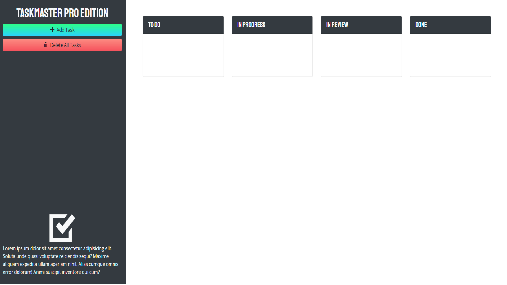

# taskinator

This app helps with the organization and completion of tasks.

## Directions

- Click "Add Task".
- Give that task a "Description".
- Enter in a "Due Date"
- Hit save changes.
- From there you can move your task over as you are in different stages with that task.
- Once completed, you can move that task over into the "Done" bucket.

### Site link

https://thejake989.github.io/taskinator/

### Site Preview

